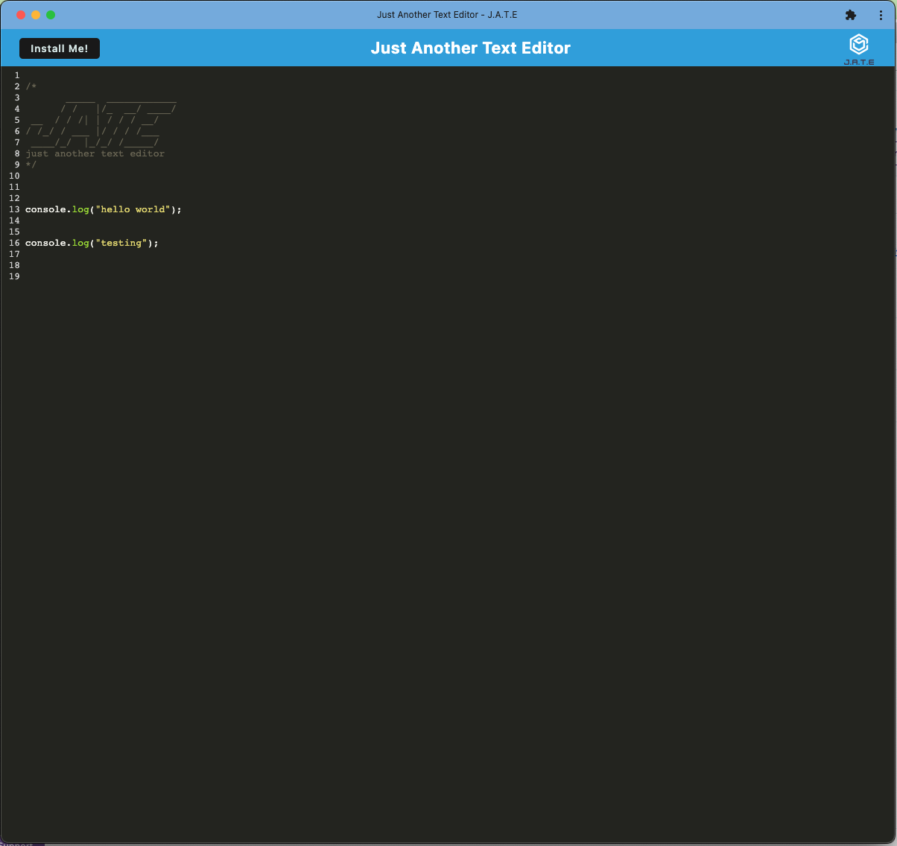

# Text Editor 

## Description

The purpose of this project was to build a text editor that runs in the browser and meets Progressive Web Application (PWA) criteria. The application features data persistence techniques that serve as redundancy in case one of the options is not supported by the browser. The application is also able to function offline.

## Questions

[pan-ev](https://github.com/pan-ev)   
   

For any additional questions, please contact epan616@gmail.com